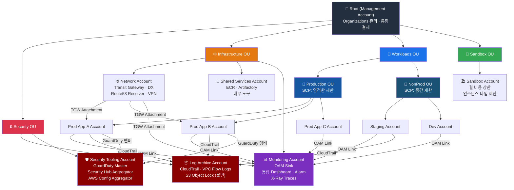
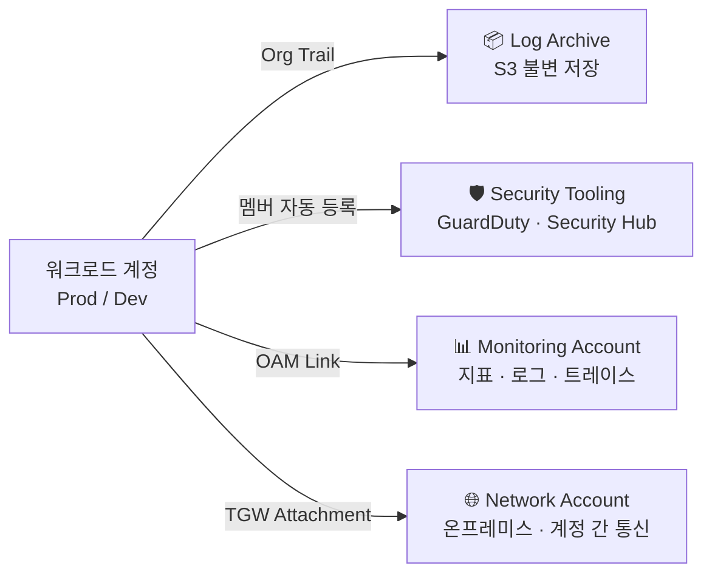
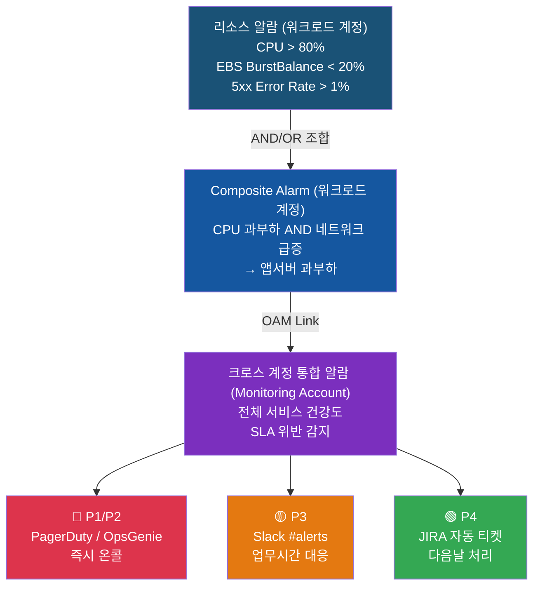

# AWS Enterprise Landing Zone 아키텍처

## 1. 개요

AWS 엔터프라이즈 환경에서 Landing Zone은 멀티 계정 구조의 기반이 되는 표준 설계다.
Organizations OU 계층으로 보안 경계를 분리하고, SCP 가드레일로 전체 계정에 정책을 일관 적용한다.
모니터링은 별도 Monitoring Account에 OAM Sink를 두어 계정별 로그인 없이 중앙 관찰한다.

---

## 2. 전체 구성도

---

## 3. 데이터 흐름

---

## 4. OU별 계정 역할 및 SCP 강도

| OU | 계정 | 역할 | SCP 제한 수준 | 주요 가드레일 |
|----|------|------|--------------|--------------|
| Root | Management | Organizations 관리, 통합 결제 | 공통 기본 | CloudTrail 비활성화 금지, Root 사용 금지, 리전 제한 |
| Security | Log Archive | CloudTrail/Flow Logs 중앙 저장 | 최고 | S3 삭제·수정 금지 (Object Lock + SCP) |
| Security | Security Tooling | GuardDuty/Security Hub/Config 집계 | 최고 | 보안팀만 접근, 설정 변경 감지 알람 |
| Infrastructure | Network | TGW, DX, Route53 Resolver, VPN | 높음 | 네트워크팀만 변경 가능 |
| Infrastructure | Shared Services | ECR, 내부 도구 공유 | 높음 | 퍼블릭 공개 금지 |
| Infrastructure | Monitoring | OAM Sink, 통합 대시보드/알람 | 높음 | 읽기 전용 접근 분리 |
| Workloads | Production | 실제 서비스 운영 | 높음 | IMDSv2 강제, 퍼블릭 S3 ACL 금지 |
| Workloads | NonProd | 개발·스테이징 환경 | 중간 | 일부 인스턴스 타입 제한 |
| Sandbox | Sandbox | 개발자 실험 | 낮음 + 비용 상한 | 고비용 인스턴스 금지, Budget 초과 시 배포 차단 |

---

## 5. 모니터링 알람 계층 구조

---

## 6. 실무 적용 포인트

- **Control Tower 활용**: 계정 팩토리(Account Factory)로 신규 계정 생성 시 Log Archive 연결, GuardDuty 활성화, OAM Link 생성 자동화
- **IP 주소 계획**: 멀티 계정 환경에서 계정별 VPC CIDR 충돌 시 TGW 연결 불가 — 계정별 `/16` 블록을 사전 할당 (`vpc-subnet-design.md` 참고)
- **새 계정 Day 1 베이스라인**: Account Factory Customization(CfCT)으로 계정 생성 즉시 CWAgent, GuardDuty, 기본 알람 자동 배포
- **Runbook 자동 연결**: 알람 → SNS → Lambda → SSM Runbook 자동 실행 (재시작, 스냅샷 등)

---

## 7. 관련 문서

- [`aws-organizations-multi-account.md`](../cost/aws-organizations-multi-account.md) — OU 구조, SCP, IAM Identity Center 상세
- [`cloudwatch-cross-account.md`](../cloudwatch/cloudwatch-cross-account.md) — OAM Sink/Link 설정 코드
- [`cloudwatch-alarm-composite.md`](../cloudwatch/cloudwatch-alarm-composite.md) — Composite Alarm 설계
- [`vpc-subnet-design.md`](../network/vpc-subnet-design.md) — 멀티 계정 CIDR 설계
- [`cloudtrail-security-audit.md`](../security/cloudtrail-security-audit.md) — Org Trail 구성
